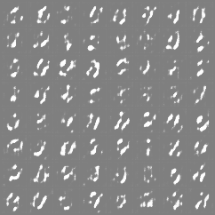
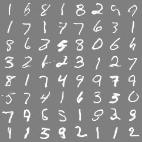

# 🖼️ Gerador de Imagens com GAN (PyTorch)

[](https://www.python.org/)  
[](https://pytorch.org/)  
[](https://fastapi.tiangolo.com/)  
[]()

---

## 📌 Visão Geral
Este projeto implementa uma **GAN (Generative Adversarial Network)** em **PyTorch**, capaz de gerar imagens sintéticas a partir de ruído aleatório.  
Inclui **pipeline de treinamento**, **API REST** com **FastAPI** e **frontend web** para geração de imagens.  

➡️ **Projeto público e open-source**  
➡️ **Ainda em fase de testes, com erros e limitações devido ao meu aprendizado em Machine Learning**  
➡️ **Foi desenvolvido com auxílio de IA para estruturar e aprender os conceitos envolvidos**  

---

## 🏗️ Estrutura do Projeto
- **`models.py`** → arquiteturas do **Gerador** e **Discriminador**  
- **`utils.py`** → checkpoints, conversão de imagens, seeds  
- **`train.py`** → pipeline de treino com MNIST  
- **`api.py`** → servidor FastAPI para gerar imagens  
- **`frontend/index.html`** → interface web simples para interação  

---

## 📚 Conceitos Técnicos

### Dataset
- **MNIST** → imagens de dígitos manuscritos (0–9), 28x28 pixels, preto e branco  

### Vetor de Ruído (Latent Vector)
- Entrada do **Gerador**, normalmente de 100 dimensões, que é transformado em uma imagem  

### Funções de Ativação
- **ReLU** → ativa valores positivos (Gerador)  
- **Tanh** → saída normalizada entre -1 e 1 (Gerador)  
- **LeakyReLU** → evita neurônios mortos (Discriminador)  

### Funções de Perda
- **Loss do Discriminador** → mede se ele acerta entre imagens reais e falsas  
- **Loss do Gerador** → mede se consegue enganar o Discriminador  

### Checkpoints
- Arquivos salvos com os pesos do modelo, para retomar treino ou gerar imagens depois  

---

## 📊 Resultados de Treinamento

A cada época, o Gerador melhora sua capacidade de criar imagens.  

### Epoch 01
Logo no início, as imagens são apenas **ruído sem forma**:  
  

### Epoch 19
Após várias épocas, os dígitos já se tornam **mais reconhecíveis**:  
  

---

## 🚀 Como Usar

### 1. Treinar o modelo
```bash
python train.py --mode train --epochs 20 --batch_size 128
```

### 2. Gerar amostras

```shellscript
python train.py --mode generate --samples 100 --checkpoint checkpoints/final_model.pth
```

### 3. Iniciar servidor API

```shellscript
python api.py
```

Acesse em `http://localhost:5000`

### 4. Usar a interface web

```plaintext
http://localhost:5000/app
```

---

## ️ Dependências

- Python 3.10+
- PyTorch / TorchVision
- FastAPI / Uvicorn
- Pillow
- NumPy
- python-multipart


Instalar dependências:

```shellscript
pip install -r requirements.txt
```

---

## Estado Atual do Projeto

- ✅ Estrutura inicial da GAN implementada
- ✅ API REST funcional
- ✅ Frontend básico disponível
- ⚠️ Ainda em **fase de testes**
- ⚠️ Contém **erros e limitações** devido ao aprendizado em ML e PY
- ⚠️ O projeto foi desenvolvido com **apoio de IA**!!


---

## Próximas Melhorias

1. Migrar para **DCGAN** com imagens coloridas 64x64
2. Implementar **Conditional GAN** (gerar dígitos específicos)
3. Adicionar métricas de avaliação (**FID, IS**)
4. Criar **galeria persistente** de imagens geradas
5. Permitir **download direto** das imagens no frontend


---

## Contribuições

Este projeto é **público e colaborativo**.Sugestões, melhorias e PRs são muito bem-vindos!

---

## Data de Criação

Outubro de 2025
